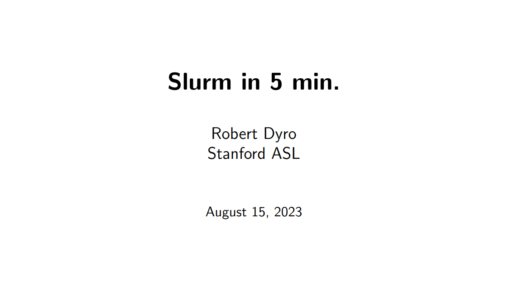

# Slurm and Stanford Sherlock (informal) Tutorial

---

## A quick Slurm Tutorial

<p align="center">
  <a href="./tutorial/build/main.pdf">
    
  </a>
</p>

Available here [main.pdf](./tutorial/build/main.pdf)

---

## Ray Tune

Check out the excellent Python framework [Ray Tune
here](https://www.ray.io/ray-tune).

A script for using Ray with Slurm is at `./ray_with_slurm`. Take a look at the
`slurm_launch.py` command line utility.

```
$ python3 ray_with_slurm/slurm_launch.py --help

usage: slurm_launch.py [-h] [--exp-name EXP_NAME] [--num-nodes NUM_NODES]
                       [--num-gpus NUM_GPUS] [--num-cpus NUM_CPUS]
                       [--load-env LOAD_ENV] --script SCRIPT
                       [--script-args SCRIPT_ARGS] [--dry]

Launch a job on slurm using ray.

optional arguments:
  -h, --help            show this help message and exit
  --exp-name EXP_NAME, --name EXP_NAME
                        The job name and path to logging file (exp_name.log).
  --num-nodes NUM_NODES, -n NUM_NODES
                        Number of nodes to use.
  --num-gpus NUM_GPUS   Number of GPUs to use for each node. (Default: 0)
  --num-cpus NUM_CPUS   Number of CPUs to use for each node. (Default: 2)
  --load-env LOAD_ENV, -e LOAD_ENV
                        The script to load your environment (e.g., 'module load
                        cuda/10.1')
  --script SCRIPT, -s SCRIPT
                        The script you wish to execute. For example: --script
                        'test.py'. Note that the script must be a path/file.
  --script-args SCRIPT_ARGS, -a SCRIPT_ARGS
                        The script arguments you wish to add. For example:
                        --script-args '--lr 1e-3 --logdir runs'. Note the quotes.
  --dry                 Whether to only generate the job file (in `./jobs`),
                        without running it. Dry run.

Example usage: python3 slurm-launch.py --script job.py --script-args 'rllib train
--run PPO --env CartPole-v0'
```
